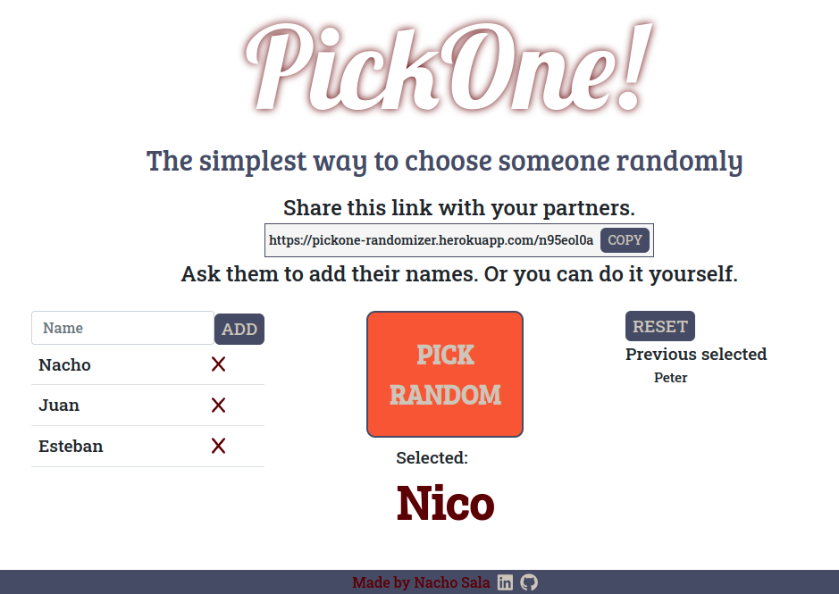

# PickOne! Randomizer

> This app is designed so that a participant can be chosen randomly in a meeting. The main difference with other sites of this type, is that a user creates a session for that meeting and then can share the link with others, and everyone can add their name. That way names don't have to be added by a single user, which is especially useful for large meetings. 



## Live Version

https://pickone-randomizer.herokuapp.com/

## Built With

- Ruby on Rails
- React
- Bootstrap

### Prerequisites

- Ruby >= 3.0.0

### Setup

- Run git clone on this project at the desired directory:
   ```
   git clone https://github.com/nachosala89/zoom-randomizer.git
   ```
- Go to the cloned directory with `cd zoom-randomizer`.
- Install dependencies with `bundle install` and `npm install`.

### Run the program
- Make sure you're inside the correct directory `zoom-randomizer`.
- Run `rails server` on the terminal to start Puma server.
- In your browser, go to `http://127.0.0.1:3000` to interact with the site.

## Authors

👤 **Nacho Sala**

- GitHub: [@nachosala89](https://github.com/nachosala89)
- Twitter: [@nachosala89](https://twitter.com/nachosala89)
- LinkedIn: [Juan Ignacio Sala](https://www.linkedin.com/in/nacho-sala)

## 🤝 Contributing

Contributions, issues, and feature requests are welcome!

## Show your support

Give a ⭐️ if you like this project! 😄
